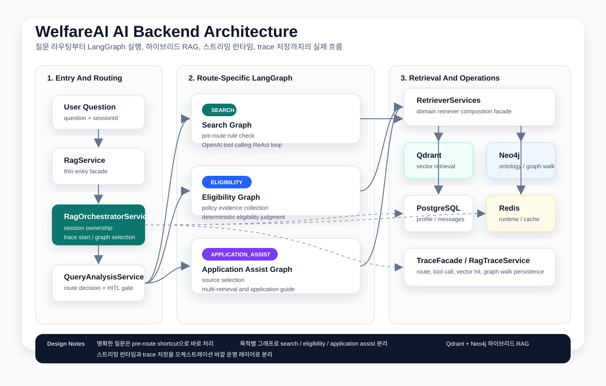

# WelfareAI의 AI 아키텍처: 질문 라우팅, Tool Calling, RAG, 그리고 운영 설계

이 글은 WelfareAI 프로젝트의 AI 백엔드 구조를 정리한 글이다.  
핵심은 단순하다. "LLM 하나에 모든 걸 맡기지 않고", 질문 유형에 따라 실행 경로를 나누고, 벡터 검색과 그래프 검색을 조합하고, 결과를 추적 가능하게 만든다.

이 프로젝트의 AI 계층은 다음 기술 위에 올라가 있다.

- 오케스트레이션: LangGraph + LangChain
- 생성 모델: OpenAI Chat 모델
- 임베딩: OpenAI Embeddings
- 벡터 검색: Qdrant
- 그래프 검색: Neo4j
- 영속 저장: PostgreSQL
- 런타임/캐시: Redis
- 추적: LangSmith + 자체 `rag_traces`

## 왜 "하나의 거대한 에이전트"로 가지 않았나

복지 도메인은 질문의 종류가 생각보다 다르다.

- "나 청년월세 지원 받을 수 있어?"는 자격 판정 문제다.
- "청년월세 지원 신청 방법 알려줘"는 절차 안내 문제다.
- "지금 신청 가능한 청약 뭐 있어?"는 현재 시점과 지역 필터가 중요한 검색 문제다.

이 세 가지를 하나의 프롬프트와 하나의 에이전트 루프로 처리하면, 모델은 매번 도구 선택과 답변 형식을 새로 추론해야 한다. 그 결과는 대체로 이렇다.

- 불필요한 tool call이 늘어난다.
- 자격 판단과 신청 안내가 섞인다.
- 현재 접수 중인지 같은 시간 민감 정보가 흔들린다.
- 운영자가 왜 이런 답이 나왔는지 추적하기 어려워진다.

그래서 WelfareAI는 범용 멀티 에이전트보다, 질문 라우팅 후 전용 그래프를 실행하는 구조를 택했다.

## 전체 구조 한눈에 보기




> Velog에 올릴 때는 이 SVG를 먼저 업로드한 뒤, 이미지 URL로 바꿔 넣으면 된다.

구조를 보면 중요한 포인트가 있다.

- `RagService`는 거의 얇은 진입점이다.
- 실제 실행 책임은 `RagOrchestratorService`가 가진다.
- 검색은 `RetrieverServices` 아래에서 도메인별로 분리된다.
- 응답 생성과 별개로 trace, runtime, streaming이 독립 레이어로 존재한다.

즉, "답변을 잘 만드는 로직"과 "운영 가능한 시스템"을 분리했다.

## 1. 첫 단계는 무조건 질문 라우팅이다

질문이 들어오면 가장 먼저 `QueryAnalysisService`가 route를 결정한다. 현재 route는 세 가지다.

- `SEARCH`
- `ELIGIBILITY`
- `APPLICATION_ASSIST`

이 판단은 거대한 분류 모델이 아니라, 도메인에 맞춘 의도 패턴과 규칙 기반 로직으로 처리한다. 이유는 명확하다.

- 복지 질문의 intent는 꽤 반복적이다.
- 규칙 기반 라우팅은 설명 가능하다.
- route 오판 시 trace에 이유를 남기기 쉽다.
- 꼭 LLM을 태우지 않아도 되는 판단에는 비용을 쓰지 않는다.

예를 들어 이런 식이다.

```text
"받을 수 있나", "자격이 되나" -> ELIGIBILITY
"신청 방법", "준비 서류", "다음 단계" -> APPLICATION_ASSIST
그 외 -> SEARCH
```

여기서 끝이 아니다. 이 서비스는 route만 정하는 게 아니라 추가 정보 요청도 담당한다.

- 지역이 없으면 지역을 물어본다.
- 청년 정책인데 나이가 없으면 나이를 물어본다.
- 주거 지원 적격성인데 소득이나 주거 상태가 없으면 그 정보를 요청한다.

이 부분이 중요한 이유는, "모르면 그냥 답한다"가 아니라 "정확도가 떨어질 때만 HITL로 되묻는다"는 정책을 코드로 강제하기 때문이다.

## 2. 이 프로젝트에서 "에이전트"는 전용 LangGraph 실행 경로다

이 프로젝트는 흔히 말하는 자유형 멀티 에이전트 시스템이 아니다.  
대신 route별로 다른 LangGraph를 둔다.

### Search Graph

검색형 질문에 쓰이는 그래프다. 이 경로만 비교적 agentic하다.

흐름은 다음과 같다.

1. 사용자 프로필과 최근 대화 이력을 로드한다.
2. 추가 정보가 필요한지 확인한다.
3. 정규식 기반 pre-route 규칙을 먼저 검사한다.
4. 규칙이 맞으면 LLM 없이 고정 tool을 바로 실행한다.
5. 규칙이 안 맞으면 OpenAI tool calling 기반 ReAct 루프를 돈다.
6. 답변을 스트리밍하고 저장한다.

여기서 핵심은 pre-route다. 예를 들면:

- "지금 신청 가능한 청약" -> `get_upcoming_deadlines`
- "청년수당", "청년도약계좌" -> `search_youth_policy`
- "행복주택 청약", "분양 공고" -> `search_housing_subscription`
- "전세자금 대출", "주거급여" -> `search_rental_support`
- "복지관 어디", "주간보호센터" -> `search_welfare_facility`

즉, 명확한 질문은 에이전트에게 "생각"시키지 않고 바로 실행한다.  
이 전략은 latency를 줄이고, 잘못된 tool planning도 줄여준다.

### Eligibility Graph

적격성 확인은 자유로운 에이전트 루프보다 절차형 workflow가 더 낫다.

흐름은 이렇다.

1. 프로필과 이력을 로드한다.
2. 부족한 정보가 있으면 질문을 되돌려준다.
3. 특정 정책 기준으로 적격성 자료를 수집한다.
4. 수집한 문서와 프로필만 근거로 판단하게 한다.
5. 답변 첫 줄을 `[가능]`, `[불확실]`, `[어려움]` 중 하나로 강제한다.

이 구조의 장점은 판정 이유를 일관되게 만들 수 있다는 점이다.  
검색형 답변처럼 이것저것 보여주는 대신, 근거와 불확실성을 드러내는 데 집중한다.

### Application Assist Graph

신청 도우미 경로는 "어떤 자료를 가져올지"가 중요하다.

흐름은 다음과 같다.

1. 프로필과 이력을 로드한다.
2. 부족한 정보가 있으면 질문을 되돌려준다.
3. 질문에 따라 필요한 source를 선택한다.
4. 여러 retriever를 병렬 실행한다.
5. 결과를 합치고 중복을 제거한다.
6. 신청 대상, 신청 순서, 준비 서류, 주의사항, 링크 순으로 답하게 한다.

예를 들어 "청년 전세 지원 신청 방법" 같은 질문은 한 소스만 보면 안 된다.

- 청년 정책 벡터 검색
- 주거 지원 벡터 검색
- 임대주택/단지 정보
- 접수 마감 정보

이 경로는 "신청 방법"이라는 사용자의 실제 목적에 맞게 컨텍스트를 조립한다.

## 3. Tool Calling은 자유도가 아니라 계약이 중요했다

Search Graph에서 사용하는 도구는 현재 다음과 같이 나뉜다.

- `search_welfare`
- `search_youth_policy`
- `search_housing_subscription`
- `search_rental_support`
- `search_welfare_facility`
- `check_policy_eligibility`
- `get_upcoming_deadlines`

중요한 건 tool의 개수보다 반환 형식이다. 이 프로젝트에서는 tool 결과를 처음부터 문자열로 만들지 않는다.

```ts
type RetrievalResult = {
  source: string
  query: string
  summary: string
  items: Array<{
    id: string
    title: string
    content: string
    source: string
    kind: string
    score?: number | null
    metadata: Record<string, unknown>
  }>
  graphSummary?: string | null
}
```

이렇게 구조화된 결과를 유지하면 장점이 많다.

- LLM에 넘기기 전까지 데이터가 깨지지 않는다.
- 관리자 trace에서 어떤 문서가 근거였는지 보여줄 수 있다.
- 후처리나 dedupe가 쉬워진다.
- 답변 생성 프롬프트와 retrieval 로직을 분리할 수 있다.

실제로 WelfareAI는 tool 내부에서는 구조화 payload를 유지하고, LLM 경계에서만 prompt block으로 직렬화한다.  
이 선택이 품질과 운영성 모두에 큰 영향을 줬다.

## 4. RAG는 "벡터 검색 하나"가 아니라 하이브리드 검색 조합이다

이 프로젝트의 RAG는 단순한 "임베딩 검색 후 답변" 구조가 아니다.  
질문 종류에 따라 Qdrant와 Neo4j를 다르게 조합한다.

### 일반 복지 검색

일반 복지 검색은 보통 이런 흐름을 탄다.

1. PostgreSQL에서 사용자 프로필을 읽는다.
2. Neo4j에서 생애주기, 지역, 대상 그룹 기반 ontology 추론을 한다.
3. 그 결과로 정책 후보 ID를 만든다.
4. Qdrant에서 해당 정책 ID를 우선 필터로 벡터 검색한다.
5. 필요하면 다시 Neo4j에서 연관 정책, 대상 그룹, 지역 정보를 보강한다.

즉, 그래프가 "정답"을 직접 주는 게 아니라, 벡터 검색의 후보군을 더 똑똑하게 줄여준다.

### 청약/주거 지원 검색

주거 영역은 조금 다르다. 현재성, 지역성, 구조화된 엔티티가 더 중요하기 때문이다.

- `search_housing_subscription`
  - Neo4j에서 모집공고 노드를 읽는다.
  - Qdrant에서 청약 공고 벡터 검색을 돌린다.
  - 두 결과를 합치고 중복 제거 후 상위 결과를 구성한다.

- `search_rental_support`
  - Neo4j에서 공공임대단지 정보를 읽는다.
  - Qdrant에서 주거 지원 관련 문서를 검색한다.
  - 다시 합치고 dedupe한다.

이 방식은 "정형 데이터 + 비정형 문서"를 한쪽에 몰아넣지 않고, 서로의 장점을 살리는 설계다.

### 적격성 확인

적격성은 검색보다 precision이 더 중요하다.

- 정책명을 기준으로 벡터 검색을 한다.
- 사용자 프로필 요약을 함께 컨텍스트로 붙인다.
- 모델에게 "제공된 프로필과 검색된 정책 문서만 근거로 판단하라"고 명시한다.

이렇게 하면 모델이 그럴듯한 행정 문구를 지어내는 일을 줄일 수 있다.

## 5. 추천 질문도 별도 전략으로 설계했다

흥미로운 점 하나는 추천 질문 생성이다.  
이 기능은 반드시 LLM을 태우지 않는다.

추천 질문은 다음 조합으로 만든다.

- 프로필 기반 규칙 템플릿
- Neo4j 기반 정책명 추천
- Qdrant 기반 유사 정책명 검색

즉, "추천 질문"조차도 가볍고 빠르게 만들되, 사용자 프로필과 현재 데이터셋을 반영한다.  
이런 보조 기능까지 LLM으로 밀어 넣지 않은 것은 비용과 반응성을 고려한 선택이다.

## 6. 스트리밍 응답은 모델만 잘 붙인다고 끝나지 않는다

대부분의 AI 제품은 "SSE로 토큰을 보낸다"까지만 이야기한다.  
실제로 운영해보면 더 중요한 건 스트림의 생명주기 관리다.

WelfareAI는 `StreamingService`와 `ChatRuntimeService`를 분리해 관리한다.

현재 SSE 계약은 다음 네 가지 이벤트다.

- `SESSION_CREATED`
- `THINK`
- `TOKEN`
- `DONE`

핵심은 런타임 상태를 메모리 Map에만 두지 않는다는 점이다.

- PostgreSQL에는 authoritative session runtime 상태를 둔다.
- Redis에는 빠른 snapshot과 wake 신호를 둔다.
- 세션이 닫히면 active stream을 중단한다.
- 스트림이 살아 있는 동안 activity wake를 계속 보낸다.

이 구조 덕분에 연결이 끊기거나 세션이 닫혀도, 백엔드가 어느 스트림이 유효한지 판단할 수 있다.

## 7. 운영에서 진짜 중요한 건 traceability다

AI 기능은 "왜 이런 답을 했는가"를 설명할 수 있어야 운영이 가능하다.  
그래서 이 프로젝트에는 별도의 trace 레이어가 있다.

추적되는 정보는 대략 이렇다.

- 질문 시작 시점
- route 결정
- 사용자 프로필 로드 여부
- pre-route 도구 선택
- agent tool call 선택
- Qdrant vector hit 목록
- Neo4j graph walk 결과
- 최종 답변
- 오류와 abort 상태

이 trace는 PostgreSQL `rag_traces`에 저장되고, 관리자 API와 UI에서 볼 수 있다.  
게다가 retriever 함수들은 LangSmith `traceable`로도 감싸져 있어서 외부 tracing과 내부 admin trace를 동시에 확보하고 있다.

이중 추적 구조를 둔 이유는 명확하다.

- LangSmith는 개발자 관점 디버깅에 좋다.
- 자체 trace는 서비스 운영과 관리자 화면에 맞게 최적화할 수 있다.

## 8. 캐시는 TTL만으로 끝내지 않고 "데이터 버전"을 같이 본다

복지 데이터는 계속 바뀐다.  
청약 공고, 청년 정책, 지역 복지, 시설 정보는 각기 다른 속도로 갱신된다.

그래서 WelfareAI는 RAG 캐시 키를 이렇게 설계했다.

- namespace
- query/profile 등 key parts
- TTL
- data version scope

여기서 핵심은 `data version scope`다.  
캐시 버전은 단순 timestamp가 아니라, `data_sync_logs`에서 해당 seed 그룹의 최신 성공 동기화 시각을 읽어 만든다.

예를 들어:

- 일반 복지 검색은 `welfare`
- 청년 정책 검색은 `youth`
- 청약 공고 검색은 `housing_subscription`
- 주거 지원 검색은 `rental_support`

즉, 데이터가 새로 들어오면 관련 캐시만 자연스럽게 무효화된다.  
TTL만 믿는 캐시보다 훨씬 운영 친화적이다.

## 9. 데이터 최신성을 위한 동기화 전략도 AI 품질의 일부다

이 프로젝트에서 AI 품질은 프롬프트만으로 결정되지 않는다.  
좋은 답변의 절반은 좋은 데이터 파이프라인에서 나온다.

현재 동기화 대상에는 이런 소스들이 포함된다.

- 중앙부처 복지서비스
- 지자체 복지서비스
- 청년정책
- 공공임대주택 단지
- 사회복지시설
- 공공주택 모집공고
- 청약홈 분양정보
- 청약 경쟁률/통계

동기화는 수동 실행과 스케줄 실행을 모두 지원하고, 각 seed마다 진행도와 로그를 남긴다.  
이 기록은 다시 캐시 버전과 연결되므로, 데이터 파이프라인과 RAG 운영이 따로 놀지 않는다.

## 10. 이 구조가 실제로 유효했던 이유

이 설계의 핵심은 "에이전트를 과하게 믿지 않는다"는 점이다.

- 분류는 규칙 기반으로 먼저 잡는다.
- 명확한 검색은 pre-route shortcut으로 바로 보낸다.
- 자유도가 필요한 곳에만 tool calling agent를 쓴다.
- 적격성과 신청 절차는 deterministic workflow로 분리한다.
- retrieval 결과는 문자열이 아니라 구조체로 유지한다.
- trace, cache, sync를 AI 바깥의 운영 계층으로 독립시킨다.

결국 중요한 것은 모델이 똑똑한가보다, 시스템이 답변을 얼마나 일관되게 만들 수 있느냐다.

## 마무리

WelfareAI의 AI 구조를 한 문장으로 요약하면 이렇다.

> "하나의 만능 에이전트"가 아니라, 질문을 먼저 분해하고, 목적에 맞는 그래프를 태우고, 하이브리드 RAG로 근거를 모으고, 운영 가능한 trace와 runtime 위에서 스트리밍하는 구조다.

이 접근은 복지처럼 조건이 복잡하고 최신성이 중요한 도메인에서 특히 잘 맞는다.  
앞으로 개선한다면, route classifier를 더 정교하게 만들고, source별 ranking 전략을 강화하고, trace 데이터를 기반으로 retrieval 품질 평가 루프까지 붙일 수 있을 것이다.

하지만 현재 시점에서도 중요한 기반은 이미 갖춰져 있다.

- 질문 라우팅
- route별 전용 그래프
- 구조화된 tool calling
- Qdrant + Neo4j 하이브리드 RAG
- PostgreSQL + Redis 기반 스트리밍 런타임
- 데이터 버전 연동 캐시
- 관리자 trace와 동기화 파이프라인

겉으로 잘 드러나지 않더라도, 실제 서비스의 신뢰도를 결정하는 건 이런 층위의 설계다.
